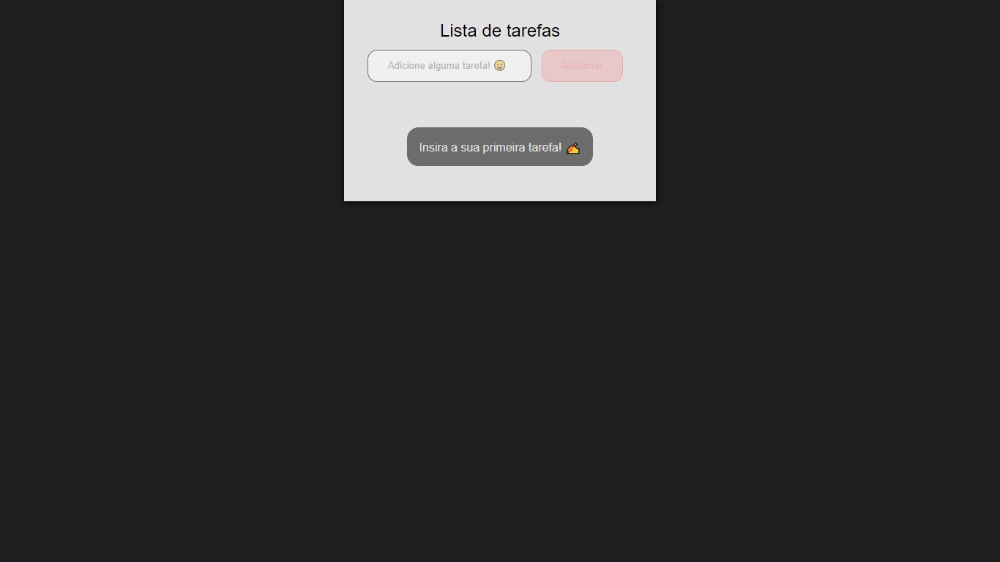

<h1>Uma Simples TO-DO LIST</h1>

    Uma simples lista de tarefas feita com HTML,CSS e JS.

Sem tarefas registradas:

Com tarefas registradas:

<a href="https://cleytonjesus07.github.io/simple-to-do-list/">Link para o projeto</a>